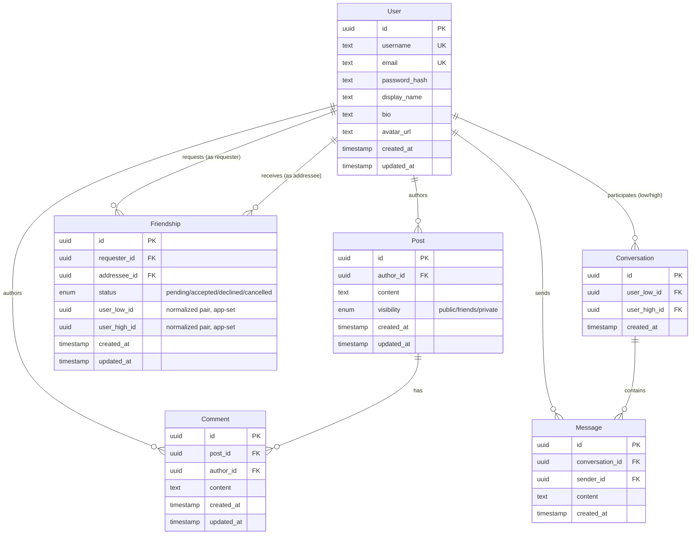

# Real-Time Social Network

A full-stack social network: authenticated users, a mutual friends graph, posts with public/friends/private visibility, a personalized feed with real-time updates, live comments, and private real-time messaging between friends.

## Tech stack

| Layer | Choice |
|---|---|
| Frontend | React + TypeScript + Vite + Tailwind CSS |
| Backend | Node.js + Express + TypeScript |
| Database | PostgreSQL, self-hosted in Docker (see [Database Design](#database-design) for why) |
| ORM | Prisma |
| Auth | Server-side sessions (`express-session` + `connect-pg-simple`) |
| Real-time | Socket.IO |
| Server state (frontend) | TanStack Query |
| Containerization | Docker Compose |

## Setup instructions

You only need [Docker Desktop](https://www.docker.com/products/docker-desktop/) installed and running. Nothing else needs to be installed on your machine: no Node.js, no database software, no accounts.

**1. Get the code onto your machine.**

Open a terminal. On Windows this can be PowerShell, Git Bash, or the terminal built into your code editor (e.g. VS Code's, opened via View → Terminal); on Mac or Linux, the Terminal app. Navigate to whichever folder you want the project saved in, then run:

```bash
git clone https://github.com/JonathanRosh/social-network.git
cd social-network
```

The first command downloads the project into a new `social-network` folder. The second moves your terminal into it. Every command below assumes you're still in this folder.

**2. Create your local config file.**

```bash
cp .env.example .env
```

This copies a template config file to `.env`. The default values already work, nothing needs editing.

**3. Start the app.**

```bash
docker compose up --build
```

This builds and starts three containers: the database, the backend, and the frontend. The first run takes a few minutes while Docker downloads and builds everything; after that it's fast. Leave this terminal open, since it's running the app.

**4. Open it.**

Go to [http://localhost:3000](http://localhost:3000) in your browser.

**5. Try it out.**

The database starts empty, so register a couple of accounts to see the app actually working. The email field isn't verified, so any value in the right format works. Two accounts to try:

| Username | Display name | Email | Password |
|---|---|---|---|
| `hank` | Hank Levi | `hank@example.com` | `password123` |
| `gina` | Gina Cohen | `gina@example.com` | `password123` |

Log in as one, send a friend request to the other, then log in as the other (in a private/incognito window, or after logging out) to accept it. Once friends, you can post with different visibility settings, comment, and message each other, and see updates arrive live if you have both accounts open in separate windows at once.

**6. Stop it.**

Press `Ctrl+C` in the terminal running it, or open a second terminal in the same folder and run:

```bash
docker compose down
```

To also delete all data in the database and start completely fresh next time:

```bash
docker compose down -v
```

### Running tests

Needs a reachable Postgres instance:

```bash
docker compose up -d postgres
cd backend
npm install
cp .env.example .env
npx prisma migrate deploy
npm test
```

### Local development

Runs the backend and frontend directly with hot reload, instead of rebuilding Docker images on every change:

```bash
docker compose up -d postgres
cd backend && npm install && cp .env.example .env && npx prisma migrate deploy && npm run dev   # http://localhost:4000
cd frontend && npm install && npm run dev                                                        # http://localhost:5173
```

## Architecture overview

```
frontend (React SPA)  ──same-origin──>  nginx (prod) / Vite dev server (dev)
                                              │
                                    proxies /api, /socket.io
                                              │
                                              ▼
                                    backend (Express + Socket.IO,
                                    one shared HTTP server/port)
                                              │
                                              ▼
                                    PostgreSQL (Prisma)
```

- **Same-origin by design.** In both development (Vite's dev-server proxy) and production (the `frontend` container's nginx config), the browser only ever talks to one origin. `/api/*` and `/socket.io/*` are transparently proxied to the backend. This avoids CORS entirely and lets the session cookie work with a simple `sameSite: "lax"`, with no cross-site cookie complications.
- **Layered backend.** Each feature lives in `backend/src/modules/<name>/` as `routes → controller → service`. Controllers are thin (parse request, call service, shape response); services hold the actual business and authorization logic, and are what the automated tests call directly, without needing to spin up an HTTP server.
- **One HTTP server, two protocols.** `backend/src/index.ts` wraps the Express app in a plain `http.Server` that both Express and Socket.IO attach to, so real-time and REST share a single process and port.
- **Docker Compose topology.** Three services: `postgres` (data, plus a published `5432` for local tooling), `backend` (internal-only, no published port, only reachable from `frontend` inside the Docker network), `frontend` (nginx, the only published port). Keeping the backend unreachable from outside Docker reduces the exposed attack surface.

### Project structure

```
backend/
  prisma/               schema + migrations
  src/
    modules/<feature>/   routes, controller, service, schema (zod) per feature
    middleware/           requireAuth, validate, errorHandler, rateLimit
    socket/                Socket.IO server + session-cookie auth bridge
    session.ts, db/, config/, utils/
  tests/                 targeted tests (see Testing)
frontend/
  src/
    api/                 typed fetch wrappers, one per backend module
    context/              AuthContext, SocketContext
    components/, pages/
    utils/                 realtime cache-merge helpers (comments, feed)
```

## Database Design

### Why PostgreSQL

Self-hosted in Docker, chosen for three reasons: no external accounts or API keys means `docker compose up` is fully self-contained; foreign keys, enums, and unique constraints let the database enforce data integrity directly instead of relying only on application code; and it pairs cleanly with Prisma for type-safe queries and schema migrations.

### Entity-Relationship Diagram



*(`session`, the login-session table, isn't shown: it's created and owned entirely by `connect-pg-simple` at runtime, outside Prisma's management, since it's infrastructure rather than app data.)*

### Key design decisions

**Friendships are a single table**, not separate "requests" and "friends" tables that could drift out of sync. Each row keeps `requesterId`/`addresseeId` (who actually sent the request) plus a normalized `userLowId`/`userHighId` pair, which lets a partial unique index guarantee at the database level that no two active friendships ever exist for the same pair, regardless of who requested:

```sql
CREATE UNIQUE INDEX friendships_active_pair_key
  ON friendships (user_low_id, user_high_id)
  WHERE status IN ('pending', 'accepted');
```

The index only covers `pending`/`accepted` rows, so a declined or cancelled request doesn't permanently block a future one.

**Visibility and feed composition are different questions.** `canViewPost(viewerId, post)` decides who can see a post directly, e.g. on a profile, and is reused everywhere that matters. The personalized feed is scoped further, to the viewer's own posts plus friends' posts only, so a stranger's public post is visible on their profile but never appears in that feed. A separate **Discover** tab surfaces public posts from everyone, for finding new people to friend.

**A post you can't see returns 404, not 403**, everywhere in the API, so a private post's existence is never confirmed to someone who shouldn't know about it.

### Enforcement split (DB layer vs. application layer)

| Rule | Enforced by |
|---|---|
| Unique username / email | DB `UNIQUE` constraint |
| No duplicate/reverse friend relationships | DB partial unique index |
| Can't friend-request or message yourself | DB `CHECK` constraint |
| Friend-request state transitions (who can accept/cancel/decline, only from `pending`) | Application service layer (+ tests) |
| Only the author may edit/delete their post or comment | Application ownership check (+ tests) |
| Post visibility resolution for a given viewer | Application service layer (+ tests) |
| Can only comment on a post you're allowed to see | Application service layer, reuses the same visibility check |
| Content length bounds | Both: DB `CHECK` as a hard floor, Zod validation for the actual user-facing error message |
| Cascading cleanup when a user is deleted | DB `ON DELETE CASCADE` |

## Real-Time Design

Socket.IO authenticates with the same session cookie as REST (`io.engine.use(sessionMiddleware)` runs on the WebSocket handshake itself), so there's no separate token to manage.

- **Comments**: a client joins a post's comment room only while that thread is open, and the server re-checks visibility on every join, so a private post's comments can't be reached just by guessing its ID.
- **Feed**: two events cover the two feed tabs. `post:created` reaches the author's friends, for the Friends tab. `post:created:public` additionally broadcasts to everyone when the post is public, for Discover.
- **Messaging**: same room-join pattern as comments, plus friendship is re-checked on every message send, so messaging stops immediately if two people un-friend each other, even in an existing conversation.
- **No duplicate events, correct ordering**: every real-time update carries a real database ID and a server-authoritative timestamp. The client merges updates by ID and re-sorts rather than trusting socket arrival order, so reconnects or multiple open tabs never produce duplicate or out-of-order items.
- Single Socket.IO instance, no Redis adapter. Not needed at this scale; would be the next step for horizontal scaling.

## API Reference

All routes below are prefixed with `/api` and require an authenticated session unless noted.

| Method | Path | Purpose |
|---|---|---|
| POST | `/auth/register` | Create an account (no auth required) |
| POST | `/auth/login` | Start a session (no auth required) |
| POST | `/auth/logout` | Destroy the session |
| GET | `/auth/me` | Current user |
| GET | `/users/:username` | Public profile + viewer's relationship to that user |
| PATCH | `/users/me` | Edit own profile (display name, bio, avatar URL) |
| GET | `/users/:username/posts` | That user's posts, visibility-filtered for the viewer |
| POST | `/friends/requests` | Send a friend request |
| GET | `/friends/requests` | List incoming + outgoing pending requests |
| POST | `/friends/requests/:id/accept` | Accept (addressee only) |
| POST | `/friends/requests/:id/decline` | Decline (addressee only) |
| DELETE | `/friends/requests/:id` | Cancel a sent request (requester only) |
| GET | `/friends` | List current friends |
| DELETE | `/friends/:userId` | Remove a friend |
| POST | `/posts` | Create a post |
| GET | `/posts/:id` | Get a single post (visibility-checked, 404 if not viewable) |
| PATCH | `/posts/:id` | Edit (author only) |
| DELETE | `/posts/:id` | Delete (author only) |
| GET | `/feed?scope=friends\|discover&cursorCreatedAt=&cursorId=&limit=` | Cursor-paginated feed; `scope=friends` (default) = own + friends' posts, `scope=discover` = every public post |
| POST | `/posts/:id/comments` | Add a comment (post must be visible to you) |
| GET | `/posts/:id/comments?cursorCreatedAt=&cursorId=&limit=` | List comments, cursor-paginated |
| PATCH | `/comments/:id` | Edit (author only) |
| DELETE | `/comments/:id` | Delete (author only) |
| POST | `/messages/conversations` | Get-or-create a conversation with a friend (`{friendId}`), 403 if not friends |
| GET | `/messages/conversations` | List my conversations, most recently active first |
| GET | `/messages/conversations/:id/messages?cursorCreatedAt=&cursorId=&limit=` | Message history, cursor-paginated (participants only, 404 otherwise) |
| POST | `/messages/conversations/:id/messages` | Send a message (participants only, friendship re-checked on every send) |

Socket.IO events: `post:created`, `post:created:public`, `comment:created`, `comment:updated`, `comment:deleted`, `message:created` (all server→client); `post:join`, `post:leave`, `conversation:join`, `conversation:leave` (client→server, with an ack).

## Testing

Targeted integration tests run against a real Postgres instance rather than mocks, since mocking Prisma's query builder would hide the actual database-level guarantees under test. Coverage focuses on the security and authorization logic that matters most:

- `friends.test.ts`: the full friend-request state machine
- `posts.visibility.test.ts`: public/friends/private visibility across owner/friend/stranger viewers
- `feed.test.ts`: feed composition vs. post visibility
- `ownership.test.ts`: only the author can edit/delete their posts and comments
- `messages.test.ts`: messaging is friends-only, re-checked on every send
- `requireAuth.test.ts`: the auth middleware

No UI test suite; frontend correctness was verified manually by exercising the running app.

```bash
cd backend
npm test
```

## Security notes

- Passwords hashed with bcrypt (via `bcryptjs`, pure-JS to avoid native-addon build issues in the Alpine Docker image), 12 salt rounds.
- Session cookie is `httpOnly` and `sameSite: lax`, signed with `SESSION_SECRET`. Its `Secure` flag is controlled by `COOKIE_SECURE` (default `false`) rather than `NODE_ENV`, because this stack runs over plain HTTP on `localhost` with no TLS termination anywhere, and `express-session` silently refuses to ever set a cookie flagged `Secure` over a non-HTTPS connection. **If this is ever deployed behind real HTTPS, set `COOKIE_SECURE=true`.**
- `helmet()` for standard security headers; `express-rate-limit` on `/auth/register` and `/auth/login` (20 requests / 15 min per IP) to blunt brute-force attempts.
- Input validated with Zod on every write endpoint; usernames and emails normalized to lowercase before any database operation.
- The backend container has no published port and is only reachable from the `frontend` container over the internal Docker network.
- Validation errors return structured 400s; unexpected errors are logged server-side and returned as a generic 500, with no stack traces or internals leaked to the client.
