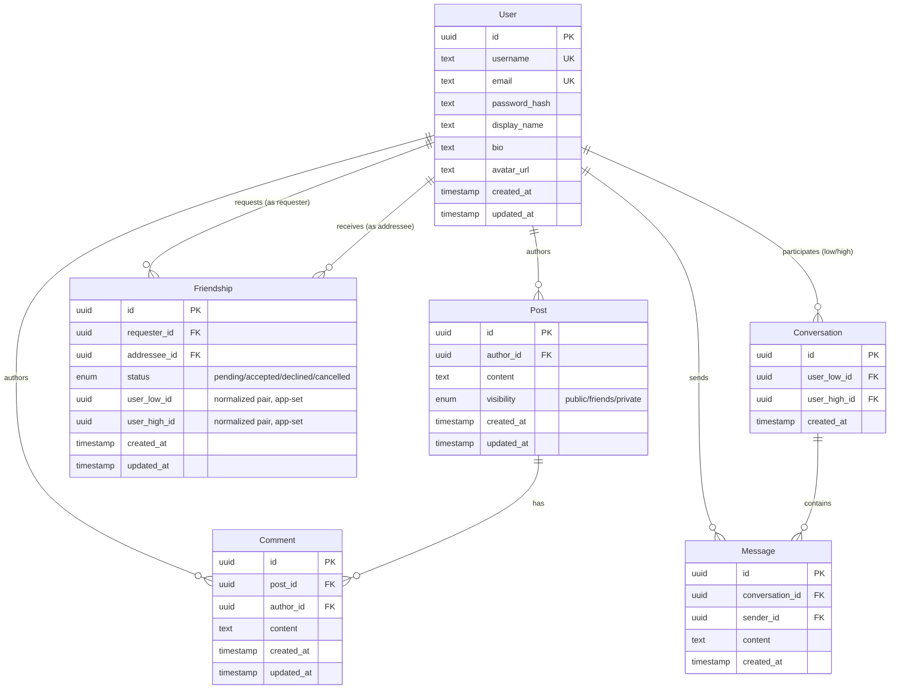

# Real-Time Social Network

A full-stack social network built for a take-home assignment: authenticated users, a mutual friends graph, posts with three-tier visibility, a personalized real-time feed, and live comments.

## Tech stack

| Layer | Choice | Why |
|---|---|---|
| Frontend | React + TypeScript + Vite + Tailwind CSS | Fast dev loop, utility CSS keeps styling lightweight |
| Backend | Node.js + Express + TypeScript | Required by the assignment |
| Database | PostgreSQL, self-hosted in Docker | Free, zero external accounts, keeps `docker compose up` fully self-contained (see [Database Design](#database-design) for the full reasoning) |
| ORM | Prisma | Type-safe queries, schema-first migrations |
| Auth | Server-side sessions (`express-session` + `connect-pg-simple`) | Cookie holds only a session ID; matches the assignment's "secure session handling" requirement |
| Real-time | Socket.IO | Authenticated via the same session cookie as REST — no separate token |
| Server state (frontend) | TanStack Query | Handles caching/loading/pagination with minimal hand-written code |
| Containerization | Docker Compose | The whole stack — database included — starts with one command |

## Setup instructions

**Requirements:** Docker Desktop (or Docker Engine + Compose) — nothing else. No Node.js, no Postgres, no accounts needed on the host.

```bash
git clone https://github.com/JonathanRosh/social-network.git
cd social-network
cp .env.example .env
docker compose up --build
```

Then open **http://localhost:3000**. That's the entire setup — the backend runs its Prisma migrations automatically on boot, so the schema is always up to date with zero manual steps.

To stop: `docker compose down` (add `-v` to also drop the database volume and start fresh next time).

### Running tests

The backend's targeted test suite (see [Testing](#testing)) needs a reachable Postgres instance:

```bash
docker compose up -d postgres
cd backend
npm install
cp .env.example .env   # then edit DATABASE_URL to point at localhost:5432, see comments in the file
npm test
```

### Local development (without rebuilding Docker images each change)

```bash
docker compose up -d postgres
cd backend && npm install && npm run dev     # http://localhost:4000
cd frontend && npm install && npm run dev    # http://localhost:5173, proxies /api and /socket.io to :4000
```

## Architecture overview

```
frontend (React SPA)  ──same-origin──>  nginx (prod) / Vite dev server (dev)
                                              │
                                    proxies /api, /socket.io
                                              │
                                              ▼
                                    backend (Express + Socket.IO,
                                    one shared HTTP server/port)
                                              │
                                              ▼
                                    PostgreSQL (Prisma)
```

- **Same-origin by design.** In both development (Vite's dev-server proxy) and production (the `frontend` container's nginx config), the browser only ever talks to one origin. `/api/*` and `/socket.io/*` are transparently proxied to the backend. This sidesteps CORS entirely and lets the session cookie work with a simple `sameSite: "lax"` — no cross-site cookie complications.
- **Layered backend.** Each feature lives in `backend/src/modules/<name>/` as `routes → controller → service`. Controllers are thin (parse request, call service, shape response); services hold the actual business/authorization logic and are what the automated tests call directly, without needing to spin up an HTTP server.
- **One HTTP server, two protocols.** `backend/src/index.ts` wraps the Express app in a plain `http.Server` that both Express and Socket.IO attach to — real-time and REST share a single process and port.
- **Docker Compose topology.** Three services: `postgres` (data + a published `5432` for local tooling), `backend` (internal-only, no published port — only reachable from `frontend` inside the Docker network), `frontend` (nginx, the only published port). Reducing the backend's exposed surface to "not exposed at all" is a small but real security choice.

### Project structure

```
backend/
  prisma/               schema + migrations
  src/
    modules/<feature>/   routes, controller, service, schema (zod) per feature
    middleware/           requireAuth, validate, errorHandler, rateLimit
    socket/                Socket.IO server + session-cookie auth bridge
    session.ts, db/, config/, utils/
  tests/                 targeted tests (see Testing)
frontend/
  src/
    api/                 typed fetch wrappers, one per backend module
    context/              AuthContext, SocketContext
    components/, pages/
    utils/                 realtime cache-merge helpers (comments, feed)
```

## Database Design

### Why PostgreSQL

The database engine wasn't provided — this was an explicit design decision. PostgreSQL was chosen, self-hosted in a Docker container, specifically because:

1. **Zero external accounts.** No Supabase/cloud project, no API keys to hand off — `docker compose up` is genuinely self-contained. A hosted free-tier database can pause after inactivity, which would be a bad surprise for whoever reviews this after a delay.
2. **Strong relational integrity.** Foreign keys, enums, `CHECK` constraints, and partial unique indexes let the database itself enforce several of the assignment's hardest requirements (no duplicate friendships, no self-friending) rather than relying purely on application code that could race under concurrent requests.
3. **Prisma pairs well with it**, giving type-safe queries and schema-first migrations with very little boilerplate.

### Entity-Relationship Diagram



*(GitHub renders the Mermaid block above natively. `session` — the login-session table — isn't shown: it's created and owned entirely by `connect-pg-simple` at runtime, deliberately outside Prisma's management, since it's third-party infrastructure, not app data.)*

### Key design decisions

**Friendship is a single table, not two.** One row models a request, an accepted friendship, or a resolved (declined/cancelled) history entry, rather than separate "requests" and "friends" tables that could drift out of sync with each other. `requesterId`/`addresseeId` preserve who actually sent the request (needed for "only the recipient can accept" authorization); `userLowId`/`userHighId` are a separate, always-normalized `(min(id), max(id))` pair set by the application on every insert, used purely so a **partial unique index** —

```sql
CREATE UNIQUE INDEX friendships_active_pair_key
  ON friendships (user_low_id, user_high_id)
  WHERE status IN ('pending', 'accepted');
```

— can guarantee, at the database level, that no two *active* rows ever exist for the same pair of people, regardless of who requested or in which direction. This is the real guarantee behind "no duplicate relationships"; an application-level "check first, then insert" would still be racy under concurrent requests. The index is partial (scoped to `pending`/`accepted`) so a declined or cancelled request doesn't permanently block a future one.

**Visibility resolution lives in application code, not the database**, because it depends on *who's asking* (the viewer), which isn't something a static schema constraint can express. `canViewPost(viewerId, post)` is one function, reused identically by the single-post endpoint, the feed query, and the comment-creation check — so "can this person comment on this post" and "does this post show up in their feed" can never silently disagree with each other.

**Fetching a post you can't see returns 404, not 403**, everywhere in the API. A 403 would leak that a private/friends-only post exists at all to someone who shouldn't even know that; 404 is indistinguishable from "there's nothing here."

### Enforcement split (DB layer vs. application layer)

| Rule | Enforced by |
|---|---|
| Unique username / email | DB `UNIQUE` constraint |
| No duplicate/reverse friend relationships | DB partial unique index |
| Can't friend-request or message yourself | DB `CHECK` constraint |
| Friend-request state transitions (who can accept/cancel/decline, only from `pending`) | Application service layer (+ tests) |
| Only the author may edit/delete their post or comment | Application ownership check (+ tests) |
| Post visibility resolution for a given viewer | Application service layer (+ tests) |
| Can only comment on a post you're allowed to see | Application service layer, reuses the same visibility check |
| Content length bounds | Both — DB `CHECK` as a hard floor, Zod validation for the actual user-facing error message |
| Cascading cleanup when a user is deleted | DB `ON DELETE CASCADE` |

## Real-Time Design

Socket.IO authenticates using the **same session cookie as REST** — `io.engine.use(sessionMiddleware)` runs the same `express-session` middleware on the WebSocket handshake request itself, so `socket.request.session` is already populated from the browser's existing cookie before the connection is even accepted. There's no second auth mechanism to keep in sync with the first.

- **Comments**: a client joins a `post:<id>` room only while actively viewing that post's comment thread (expanding "Comments" on a post), not for every post in a feed at once. The server re-runs the same visibility check used everywhere else before allowing the join, so a private post's comment stream can't be peeked at just by knowing its ID.
- **New posts**: fan-out audience exactly mirrors the feed's own visibility rule — `public` posts broadcast to every connected client, `friends` posts go to each accepted friend's personal room, `private` posts go only to the author (so their other open tabs update too).
- **No duplicate events, correct ordering.** Every emitted entity carries its real database ID and a server-authoritative `createdAt`. The frontend never trusts socket arrival order — every update (from a REST response *or* a socket event) goes through the same dedupe-by-id-then-resort merge (`frontend/src/utils/commentsCache.ts`, `feedCache.ts`). The server doesn't special-case "don't echo to the sender" — it always emits to everyone in the room including the author, and the client's dedupe makes that a safe no-op. This also correctly handles the same user having multiple tabs open.
- **Single instance.** No Redis adapter — not needed at this scale, and out of scope for a take-home assignment. The next step for horizontal scaling would be a Redis-backed Socket.IO adapter.

## API Reference

All routes below are prefixed with `/api` and require an authenticated session unless noted.

| Method | Path | Purpose |
|---|---|---|
| POST | `/auth/register` | Create an account (no auth required) |
| POST | `/auth/login` | Start a session (no auth required) |
| POST | `/auth/logout` | Destroy the session |
| GET | `/auth/me` | Current user |
| GET | `/users/:username` | Public profile + viewer's relationship to that user |
| PATCH | `/users/me` | Edit own profile (display name, bio, avatar URL) |
| GET | `/users/:username/posts` | That user's posts, visibility-filtered for the viewer |
| POST | `/friends/requests` | Send a friend request |
| GET | `/friends/requests` | List incoming + outgoing pending requests |
| POST | `/friends/requests/:id/accept` | Accept (addressee only) |
| POST | `/friends/requests/:id/decline` | Decline (addressee only) |
| DELETE | `/friends/requests/:id` | Cancel a sent request (requester only) |
| GET | `/friends` | List current friends |
| DELETE | `/friends/:userId` | Remove a friend |
| POST | `/posts` | Create a post |
| GET | `/posts/:id` | Get a single post (visibility-checked, 404 if not viewable) |
| PATCH | `/posts/:id` | Edit (author only) |
| DELETE | `/posts/:id` | Delete (author only) |
| GET | `/feed?cursorCreatedAt=&cursorId=&limit=` | Personalized, cursor-paginated feed |
| POST | `/posts/:id/comments` | Add a comment (post must be visible to you) |
| GET | `/posts/:id/comments?cursorCreatedAt=&cursorId=&limit=` | List comments, cursor-paginated |
| PATCH | `/comments/:id` | Edit (author only) |
| DELETE | `/comments/:id` | Delete (author only) |

Socket.IO events: `post:created` (server→client), `comment:created` / `comment:updated` / `comment:deleted` (server→client), `post:join` / `post:leave` (client→server, with an ack).

## Testing

Targeted, integration-style tests against a real Postgres instance (not mocked — mocking Prisma's query builder would have obscured the actual database-level guarantees under test), covering exactly the security/authorization-critical logic the assignment is graded on:

- **`friends.test.ts`** — the full friend-request state machine: self-request rejection, duplicate-while-pending rejection from either direction, only-addressee-can-accept, already-friends rejection, remove-then-refriend, only-requester-can-cancel, decline-then-resend.
- **`posts.visibility.test.ts`** — public/friends/private visibility resolved correctly across owner/friend/stranger viewers.
- **`ownership.test.ts`** — only the author can edit/delete their posts and comments.
- **`requireAuth.test.ts`** — the auth middleware rejects unauthenticated requests and passes authenticated ones through.

No UI test suite — deliberately out of scope given the timeline; correctness there was verified through manual end-to-end exercising of the running app (see commit history / `CLAUDE.md` for the specifics of what was checked at each stage).

```bash
cd backend
npm test
```

## Security notes

- Passwords hashed with bcrypt (via `bcryptjs`, pure-JS to avoid native-addon build issues in the Alpine Docker image), 12 salt rounds.
- Session cookie is `httpOnly` + `sameSite: lax`, signed with `SESSION_SECRET`. Its `Secure` flag is controlled by `COOKIE_SECURE` (default `false`) rather than `NODE_ENV`, because this stack runs over plain HTTP on `localhost` with no TLS termination anywhere — `express-session` silently refuses to ever set a cookie flagged `Secure` over a non-HTTPS connection, which would otherwise break login with no obvious error. **If this is ever deployed behind real HTTPS, set `COOKIE_SECURE=true`.**
- `helmet()` for standard security headers; `express-rate-limit` on `/auth/register` and `/auth/login` (20 requests / 15 min per IP) to blunt brute-force attempts.
- Input validated with Zod on every write endpoint; username/email normalized to lowercase before any DB operation.
- The backend container has no published port — only reachable from the `frontend` container over the internal Docker network, reducing the exposed attack surface to one nginx front door.
- All input validation errors return structured 400s; unexpected errors are logged server-side and returned as a generic 500 (no stack traces or internals leaked to the client).

## Known limitations / scope decisions

- No password reset / email verification flow — out of scope for the assignment.
- No rich media (image uploads) — posts and comments are text-only.
- Feed and comment pagination default to page sizes of 20 and 50 respectively; no configurable "load more" size in the UI beyond that.
- Socket.IO runs as a single instance with no Redis adapter — correct for one backend replica, which is what Docker Compose runs here. Horizontal scaling would need that adapter.
- See `CLAUDE.md` in this repo for the full phase-by-phase build log, including every decision, trade-off, and bug caught along the way.
